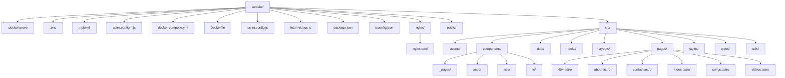

# André Valério Website 🌐  – [andrevalerio.com][1]

[andrevalerio.com][1] is a [static website][gl-static-page] for the Canadian musician & composer [André Valério](#about---andré-valério).

This [website][1] was built with [Astro][astro] + [integrations][astro-integrations] such as [React][react], see the [tech stack](#tech-stack-%EF%B8%8F "Development tools").

The [website][1] has an emphasis on [SEO](#seo), content & performance.

---

## Tech stack 🛠️

[Astro][astro] as a [SSG](https://developer.mozilla.org/en-US/docs/Glossary/SSG "Static Site Generator mozilla") with [Astro integrations][astro-integrations].

**Major tools**:

- [**Astro**][astro]
- [**React**][react]
- [**Typescript**](https://www.typescriptlang.org/)
- [**Sass**](https://sass-lang.com/)

<small>See the full [package.json here](./website/package.json)</small>

## Deploy & [CI/CD](https://github.com/resources/articles/devops/ci-cd)

The [website][1] is served by a [global CDN](https://render.com/docs/static-sites#global-cdn) in [render.com](https://render.com/ "Render plataform (Web-Host)"), I also used the [IaC model](https://aws.amazon.com/what-is/iac/ "Infraestructure as Code model (AWS)") with [Render blueprints](https://render.com/docs/infrastructure-as-code "Render.com blueprints Docs"), see the [render.yaml file](./render.yaml).

You can also deploy with [Docker][docker], build with [Astro][astro] and host a [web-server](https://developer.mozilla.org/en-US/docs/Learn_web_development/Howto/Web_mechanics/What_is_a_web_server "Web server overview - MDN reference") with [NGINX](https://nginx.org/ "nginx website").  Check the [`Dockerfile`](./website/Dockerfile).

    
<small>Available domains</small>

     
    <ul>
        <li><a href="https://andrevalerio.com/" title="Registered domain">andrevalerio.com</a></li>
        <li><a href="https://andrevalerio.onrender.com/" title="Render.com domain">andrevalerio.onrender.com</a></li>
        <li><a href="https://adrianolmrs.github.io/AndreValerio/" title="Github Pages domain">adrianolmrs.github.io/AndreValerio</a> <small><b>(Not working as expected)</b></small></li>
    </ul>

I also used [Github Actions][github-actions] to deploy to [Github Pages][github-pages] see _[deploy.yml file](./.github/workflows/deploy.yml)_, **and** I used [actions][github-actions] to trigger a [Render deploy hook](https://render.com/docs/deploy-hooks) every 24 hours, see _[daily-deploy.yml file](./.github/workflows/daily-deploy.yml)_, check [why I did that](#pages).

## Website content

Website pages content & folder structure

### Pages

- **[/home][1]** [`index.astro`](./website/src/pages/index.astro): The main landing page introducing André Valério and his work.
- **[/about][about]** [`about.astro`](./website/src/pages/about.astro): A page detailing André Valério's biography, career, and achievements.
- **[/songs][songs]** [`songs.astro`](./website/src/pages/songs.astro): A showcase of André Valério's music, including albums, singles, and collaborations.  The songs is fetched using the [Spotify Web API](https://developer.spotify.com/documentation/web-api "Spotify Web API Overview") and embeded using the [Spotify Embed API](https://developer.spotify.com/documentation/embeds "Spotify Embed API Overview").
- **[/videos][videos]** [`videos.astro`](./website/src/pages/videos.astro): A page showcasing André Valério's video content, including gallery of featured & latest videos.  The videos is fetched using the [Youtube v3 API][YT-API] in `prebuild` before `npm run build`, check [(`fetch-videos.js`)](./website/fetch-videos.js) file. [GIT Commit][Commit-prebuild]
- **[/contact][contact]** [`contact.astro`](./website/src/pages/contact.astro): A page with a contact form (using [formsubmit](https://formsubmit.co/ "Formsubmit home page") endpoints) and links to André Valério's social media profiles.
- **[/404][error404]** [`404.astro`](./website/src/pages/404.astro): A custom error page for handling non-existent routes.
- **/lessons**: _In development..._

<small>I used the [Astro Frontmatter](https://docs.astro.build/en/guides/cms/frontmatter-cms/) in multiple pages to fetch data _(mainly from [Youtube v3][YT-API] & [Spotify][Spotify-API])_, like in the [/songs][songs] that fetch the user latest Spotify songs and [/videos][videos] that fetch the user latest Youtube videos, because it's a [static website][gl-static-page] and the [API calls](https://developer.mozilla.org/en-US/docs/Learn_web_development/Extensions/Client-side_APIs/Introduction "API Calls MDN reference") only happen during the [build process](https://medium.com/@olganedelcuam/npm-build-a-deep-dive-into-the-build-process-51758b48fbf8 "Medium Article about build"), I used [Actions][github-actions] to trigger a deploy every 24 hours, check [(`daily-deploy.yml` file)](./.github/workflows/daily-deploy.yml).</small>

#### Folder structure

<pre>
<a href="./website/">website/</a>
├── <a href="./website/.dockerignore">.dockerignore</a>         # Specifies files and directories to ignore in Docker builds.
├── <a href="./website/.nojekyll">.nojekyll</a>             # Prevents Jekyll processing on GitHub Pages.
├── <a href="./website/astro.config.mjs">astro.config.mjs</a>      # Configuration file for the Astro framework.
├── <a href="./website/docker-compose.yml">docker-compose.yml</a>    # Docker Compose configuration for multi-container applications.
├── <a href="./website/Dockerfile">Dockerfile</a>            # Instructions to build the Docker image for the project.
├── <a href="./website/eslint.config.js">eslint.config.js</a>      # ESLint configuration for linting JavaScript/TypeScript files.
├── <a href="./website/fetch-videos.js">fetch-videos.js</a>       # Script to fetch video data, for the /videos page (used in prebuild).
├── <a href="./website/package.json">package.json</a>          # Node.js project metadata and dependencies.
├── <a href="./website/tsconfig.json">tsconfig.json</a>         # TypeScript configuration file.
├── <a href="./website/nginx/">nginx/</a>                # NGINX configuration folder (if I want to deploy w/ Docker).
│   └── <a href="./website/nginx/nginx.conf">nginx.conf</a>        # NGINX server configuration file.
├── <a href="./website/public/">public/</a>               # Static assets served directly to the client (e.g., images, fonts).
└── <a href="./website/src/">src/</a>                  # Source code for the website.
    ├── <a href="./website/src/assets/">assets/</a>           # Static assets like images, fonts, and other media.
    ├── <a href="./website/src/components/">components/</a>       # Reusable UI components.
    │   ├── <a href="./website/src/components/_pages/">_pages/</a>       # Components specific to individual pages.
    │   ├── <a href="./website/src/components/astro/">astro/</a>        # Components written in the .astro format.
    │   ├── <a href="./website/src/components/nav/">nav/</a>          # Components related to the navigation bar.
    │   └── <a href="./website/src/components/ts/">ts/</a>           # Components written in the .ts format.
    ├── <a href="./website/src/data/">data/</a>             # Constants & data for the website.
    ├── <a href="./website/src/hooks/">hooks/</a>            # Custom hooks for managing state or logic.
    ├── <a href="./website/src/layouts/">layouts/</a>          # Layout components for structuring pages.
    ├── <a href="./website/src/pages/">pages/</a>            # Individual pages of the website.
    │   ├── <a href="./website/src/pages/404.astro">404.astro</a>     # Custom 404 error page.
    │   ├── <a href="./website/src/pages/about.astro">about.astro</a>   # About page detailing André Valério's biography.
    │   ├── <a href="./website/src/pages/contact.astro">contact.astro</a> # Contact page with a form and social media links.
    │   ├── <a href="./website/src/pages/index.astro">index.astro</a>   # Main landing page of the website.
    │   ├── <a href="./website/src/pages/songs.astro">songs.astro</a>   # Page showcasing André Valério's music.
    │   └── <a href="./website/src/pages/videos.astro">videos.astro</a>  # Page for displaying video content.
    ├── <a href="./website/src/styles/">styles/</a>           # General SCSS styles for the website.
    ├── <a href="./website/src/types/">types/</a>            # TypeScript type definitions for the project.
    └── <a href="./website/src/utils/">utils/</a>            # Utility functions and helpers.
</pre>

<strong>Mermaid graph</strong> <small><i>just for fun 😁</i></small>

 

 

## SEO

The website was created with the main focus on [SEO][SEO] because one of the main objectives was to appear in [Google searches](https://developers.google.com/search/docs/fundamentals/how-search-works "Google Search - Google"), this also had a great influence on the choice of the [Astro framework][astro], which is excellent when it comes to the subject and has several [integrations][astro-integrations].

Test in [Google Lighthouse](https://googlechrome.github.io/lighthouse/viewer/?psiurl=https%3A%2F%2Fandrevalerio.com%2F&strategy=mobile&category=performance&category=accessibility&category=best-practices&category=seo&category=pwa&utm_source=lh-chrome-ext# "andrevalerio.com lighthouse test") or [Google pagespeed insights](https://pagespeed.web.dev/analysis?url=https%3A%2F%2Fandrevalerio.com%2F "andrevalerio.com pagespeed test").

Some strategies applied for [SEO][SEO] were:

- [**Structured data markup**](https://developers.google.com/search/docs/appearance/structured-data/intro-structured-data "Structured data intro - Google") with [schema.org](https://schema.org/), _used integrations: [Astro-Seo-Schema][astro-in-schema]._  [Test here.](https://search.google.com/test/rich-results?url=https%3A%2F%2Fandrevalerio.com%2F "Google rich snippets test")
- [**Website Metadata**](https://developer.mozilla.org/en-US/docs/Learn_web_development/Core/Structuring_content/Webpage_metadata "Website metadata - MDN reference"), _used integrations: [Astro-Seo][astro-in-seo]._
- [**`Robots.txt`**](./website/public/robots.txt) file & [sitemap](https://developers.google.com/search/docs/crawling-indexing/sitemaps/overview "Sitemap intro - Google"), _used integrations: [Astro-Sitemap][astro-in-sitemap]._
- [**Microdata in HTML**](https://developer.mozilla.org/en-US/docs/Web/HTML/Guides/Microdata "Microdata - MDN reference").
- Good [**HTML semantics**](https://developer.mozilla.org/en-US/docs/Glossary/Semantics#semantics_in_html "HTML semantics - MDN reference"), which causes good [accessibility](https://developer.mozilla.org/en-US/docs/Learn_web_development/Core/Accessibility/What_is_accessibility "Accessibility - MDN reference") overall.

<small>Integrations metioned</small>

- [Astro-Seo][astro-in-seo].
- [Astro-Seo-Schema][astro-in-schema].
- [Astro-Sitemap][astro-in-sitemap].

## About - [André Valério][2]

A little bit [about André Valério][about]

### Who is [André Valério][about]

[André Valério][2] is a Brazilian-born guitarist, composer, arranger, and educator based in Toronto, celebrated for his versatility, passion for teaching, and deep connection to Brazilian music traditions.  [See more about André Valério.][about]

### Client Testimonial

> I had a poorly functioning website for about five years, until I met Adriano. He built a new site from scratch, exactly the way I needed it, and he's always available for adjustments and updates whenever necessary.  
> In addition to solving the technical issues, Adriano also helped me sync the site with Google, which greatly improved my online visibility.  
> I highly recommend his work!  
> -- <cite>[_André Valério_][2]</cite>

## About - [Adriano Rossi][adriano] (Developer)

I'm [Adriano][adriano], a [Full-Stack](https://www.w3schools.com/whatis/whatis_fullstack.asp) developer with experience in developing [web applications](https://en.wikipedia.org/wiki/Web_application). I'm passionate about both [frontend](https://en.wikipedia.org/wiki/Front-end_web_development) and [backend](https://en.wikibooks.org/wiki/Web_Development/What_is_a_backend%3F), and I also work with [Docker][docker] and [application deployment](https://www.vmware.com/topics/application-deployment) on platforms like [GitHub Pages][github-pages] and [Render](https://render.com/). Always looking for new challenges, I'm open to opportunities to grow and contribute to the world of technology. Check out my projects on [GitHub][adriano-github] and [get in touch](https://github.com/AdrianoLMRS/#contato)!

[**See more about Adriano**][adriano-about].

### Developer experience

Great, no more words.  The [Astro contribuitors team](https://docs.astro.build/en/contribute/#our-contributors) is just phenomenal, couldn't have chosen a better framework.
Of course, as it is a "new" tool, it inevitably has some [bugs](https://github.com/withastro/astro/issues/ "Astro github issues").

For me, the difference was the way I was able to have absolute control over what to [render](https://docs.astro.build/en/concepts/islands/ "Astro islands architecture") on the web.

<!-- Website - André Valério links -->
[1]: https://andrevalerio.com/ "André Valério - website"
[about]: https://andrevalerio.com/about/ "André Valério About page"
[songs]: https://andrevalerio.com/songs/ "André Valério Spotify Songs"
[videos]: https://andrevalerio.com/songs/ "André Valério Youtube Videos"
[contact]: https://andrevalerio.com/contact/ "André Valério Contact page"
[error404]: https://andrevalerio.com/404.html "André Valério 404 page"
[2]: https://g.co/kgs/Djfi9FM "André Valério knowledge panel"
<!-- Astro related links -->
[astro]: https://astro.build/ "Astro framework"
[astro-integrations]: https://astro.build/integrations/ "Astro integrations"
[astro-in-sitemap]: https://docs.astro.build/en/guides/integrations-guide/sitemap/ "@astrojs/sitemap integration for Astro"
[astro-in-schema]: https://github.com/codiume/orbit/tree/main/packages/astro-seo-schema#readme "astro-seo-schema integration for Astro"
[astro-in-seo]: https://github.com/jonasmerlin/astro-seo#readme "astro-seo integration for Astro"
<!-- Github related -->
[github-actions]: https://github.com/features/actions "Github Actions"
[github-pages]: https://pages.github.com/ "Github Pages"
[Commit-prebuild]: https://github.com/AdrianoLMRS/AndreValerio/commit/8e96b849d779791bc017610896c1febb69537c02#diff-3d62ff5b75ea06afd756cd96c43165f01b0251a7f253227fef99b35bbd0e5befR1 "fetch-videos.js file commit"
<!-- Others -->
[SEO]: https://developers.google.com/search/docs/fundamentals/seo-starter-guide "What is SEO - Google"
[react]: https://react.dev/ "React framework"
[docker]: https://www.docker.com/ "Docker website"
[YT-API]: https://developers.google.com/youtube/v3/docs "Youtube v3 API Documentation"
[Spotify-API]: https://developer.spotify.com/ "Spotify Developer introduction"
[gl-static-page]: https://en.wikipedia.org/wiki/Static_web_page "Wikipedia Static web page"
<!-- Developer links -->
[adriano]: https://portfolio-adriano-p4dj.onrender.com/ "Adriano Rossi (Dev & author) - website"
[adriano-about]: https://portfolio-adriano-p4dj.onrender.com/#about "Adriano Rossi - About (website)"
[adriano-github]: https://github.com/AdrianoLMRS/ "Adriano Rossi - Github profile"
